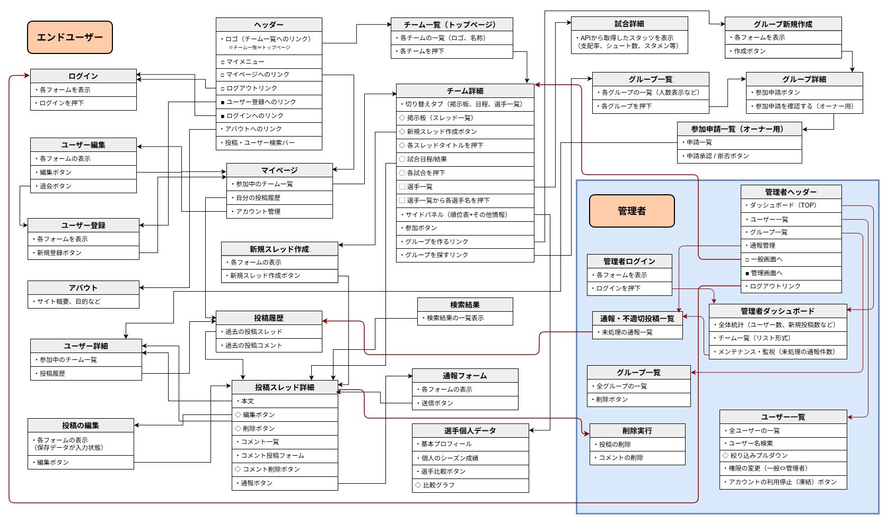
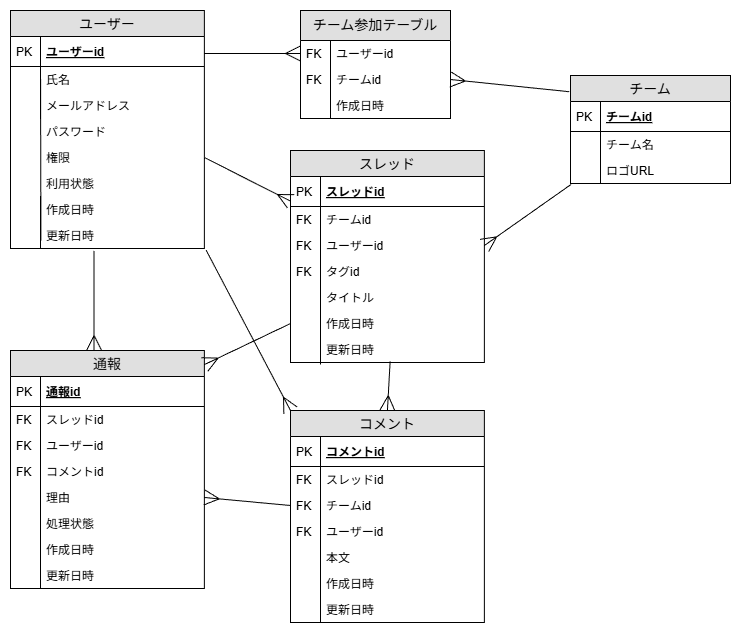

# PremierHub
## サイト概要
### サイトテーマ
プレミアリーグ全20チームのサポーターが、スタッツデータに基づいた深い議論と交流を楽しめるチーム特化型コミュニティサイト。
​
### テーマを選んだ理由
私は以前からアーセナルという海外サッカークラブを熱心に応援しており、毎週プレミアリーグを観戦しています。しかし、現在のSNS（特にXなど）では、他チームのサポーターとの不要な衝突が起こりやすく、自分の推しチームについて安心して深く語り合える場所が少ないと感じていました。

また、海外サッカー界では移籍の噂が絶えませんが、新加入候補の選手が「現在の自チームの選手と比較してどの程度優れているのか」を調べる際、複数のスタッツサイトを行き来して比較するのは非常に手間がかかります。

同じように「信頼できるデータに基づいた議論をしたい」「自チームのファン同士で熱く語りたい」という課題を持つサポーターは多いと考え、チームごとのパーソナライズ機能と、他リーグの選手ともスタッツ比較ができる「スカウティング機能」を兼ね備えた本サービスを制作することにいたしました。

### ターゲットユーザー
・プレミアリーグに特定の推しチーム（マイチーム）があり、そのチームの話題を深く語り合いたい人

・感情的な議論だけでなく、得点期待値や成功率などの客観的なデータを用いて推しチームについて考えたい人

・移籍市場において、噂になっている選手の能力を現在の所属選手と比較して分析したい人
​
### 主な利用シーン
・試合中や試合前後に、同じチームを応援するサポーター同士でリアルタイムに戦況やスタメンについて語り合う時

・移籍の噂が出た際に、候補選手と自チームの主力選手をスタッツ比較機能で分析し、補強の是非を検討する時

・リーグの順位表やチーム内得点ランキングなど、最新のスタッツを素早く確認したい時

## 機能一覧
### 実装予定の機能
- [ ] ユーザー登録・ログイン機能
- [ ] チームお気に入り登録（マイチーム設定）
- [ ] 掲示板（スレッド・コメント）機能
- [ ] 外部API連携による試合結果・スタッツ表示
- [ ] 選手比較（スカウティング）機能
- [ ] 通報・管理者機能
​
## 設計書
### 画面遷移図（UI Flow）

### ER図

### テーブル定義
詳細な型や制約については[こちらのスプレッドシート](https://docs.google.com/spreadsheets/d/1iftSEzT65KPO0Hnorf4kkEzUb_gJ9YduGhni4963028/edit?gid=1630132492#gid=1630132492)もご参照ください。

| テーブル名 | 物理名 | 役割 |
| :--- | :--- | :--- |
| ユーザー | users | ユーザー情報・権限管理 |
| チーム | teams | プレミアリーグ20チームのマスターデータ |
| チーム参加 | user_teams | ユーザーとチームの中間テーブル |
| スレッド | threads | チームごとの掲示板スレッド |
| コメント | comments | スレッド内の投稿 |
| 通報 | reports | 不適切コンテンツの管理 |

## アプリケーション詳細設計書 
本アプリケーションの設計資料は以下のスプレッドシートにまとめています。
- [設計資料（ルーティング・バリデーションなど）](https://docs.google.com/spreadsheets/d/1oJa1i8_ZIlLG-BEyH_73UlzAdQjGuDi1ot0LZ8yvzXg/edit?gid=331864542#gid=331864542)

​
## 開発環境
- OS：Windows
- 言語：HTML,CSS,JavaScript,Ruby,SQL
- フレームワーク：Ruby on Rails
- JSライブラリ：jQuery
- IDE：Visual Studio Code（VSCode）
​
## 使用素材
著作権を考慮し、チームロゴや選手画像はプレースホルダー（代用アイコン）やテキスト表示、またはAPIの利用規約で許可された範囲のデータを利用する予定です。 また、実在するデータ（試合結果・統計数値）については、外部API（API-Football等）から取得します。 なお今後、実在する著作物を利用する際には、事前に著作権保持者と契約を結んだ上で利用します。